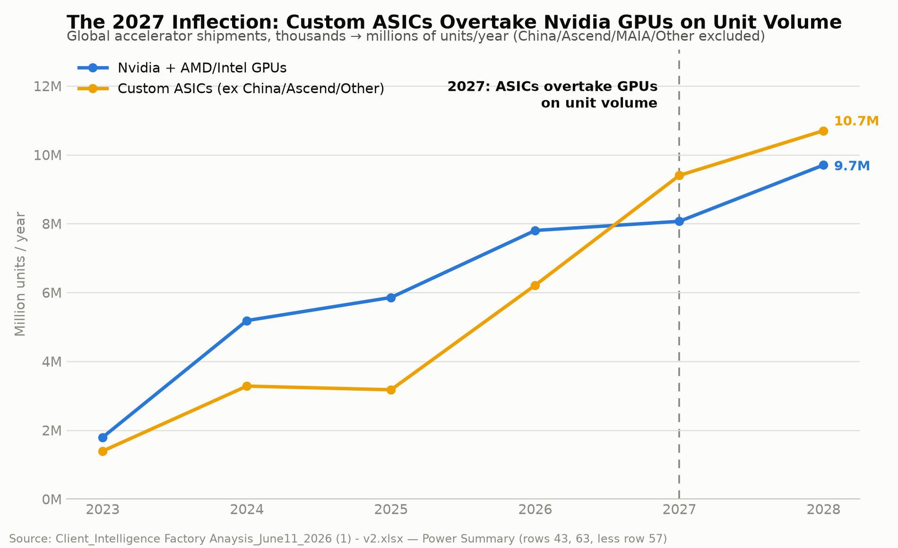

# ASIC Chips vs. Nvidia — The Inflection, and What It Means

*A summary of the analysis on whether custom AI accelerators (ASICs) designed by North American hyperscalers are overtaking Nvidia GPUs, and what that shift ripples into across the semiconductor supply chain.*

> **Scope note.** None of the three source workbooks split chip shipments by geography — all unit/compute figures below are **global**. The "North America" angle is about *who designs the chips*: every ASIC program discussed here (Google TPU, AWS Trainium, Microsoft Maia, Meta MTIA, OpenAI's chip) is a North American hyperscaler's program, even though — like Nvidia's GPUs — virtually all of them are fabricated at TSMC in Taiwan.

---

## Bottom line

- **Yes, ASICs overtake Nvidia GPUs on unit volume — in 2027**, once a mixed "China/Ascend/Other" bucket is correctly excluded from the comparison.
- **No, they don't overtake Nvidia on compute** — even granting ASICs full efficiency parity with Nvidia's watts-to-FLOPs ratio, they supply roughly a quarter to a third of total compute through 2028. Units and compute are different races, and Nvidia is still winning the second one.
- **The real constraints aren't the chips themselves** — they're the shared, slower-to-scale layers underneath: HBM memory, TSMC's CoWoS advanced packaging, and (as covered separately) interconnect. ASIC growth doesn't relieve pressure on these — it adds a second, better-funded set of bidders for the same scarce capacity.

---

## The inflection graph

*Source: `Client_Intelligence Factory Anaysis_June11_2026 (1) - v2.xlsx`, `Power Summary` tab (row 43 = Total GPUs, row 63 = Total Custom ASICs, less row 57 = China/Ascend/MAIA/Other).*

| Year | Nvidia + AMD/Intel GPUs (k units) | Custom ASICs, ex-China (k units) | ASIC − GPU |
|---|---:|---:|---:|
| 2023 | 1,794 | 1,393 | −401 |
| 2024 | 5,184 | 3,280 | −1,904 |
| 2025 | 5,854 | 3,173 | −2,681 |
| 2026 | 7,801 | 6,211 | −1,590 |
| **2027** | **8,067** | **9,400** | **+1,333** |
| 2028 | 9,701 | 10,700 | +999 |

### How we got to "2027," not "2026"

The first version of this comparison showed ASICs crossing GPUs in **2026** — but that used the raw `Total Custom ASICs` row, which bundles in a **"China/Ascend/MAIA/Other"** line (Huawei Ascend, other Chinese accelerators, and an ambiguous "MAIA 100/Other" tail). Stripping that bucket out — because it's a fundamentally different phenomenon (see [Geopolitics vs. economics](#geopolitics-vs-economics-two-different-asic-stories), below) — pushes the real, comparable crossover to **2027**, with GPUs actually *ahead* by 1.6M units as late as 2026.

> **Labeling caveat:** row 57's own label ("China/Ascend/**MAIA 100**/Other") suggests it may partially double-count with Microsoft's Maia 100 volume, which is also tracked separately in a dedicated "Total MSFT" row. This is a genuine ambiguity in the source file we can't fully resolve without the underlying analyst notes — flagged here rather than glossed over.

---

## Units ≠ compute: Nvidia still wins the bigger race

A unit-count crossover sounds decisive, but it isn't the whole story. Using the client model's NVIDIA ExaFLOPs-sold series and assuming — generously — that ASICs match Nvidia's FLOPs-per-watt exactly (an **efficiency-parity estimate**, since none of the three files disclose ASIC FLOPs directly), ASICs still supply only a **minority of total compute**:

| Year | Nvidia ExaFLOPs (sourced) | ASIC ExaFLOPs (parity estimate) | ASIC share of compute |
|---|---:|---:|---:|
| 2024 | 14,720 | 5,638 | 27.7% |
| 2025 | 43,570 | 14,120 | 24.5% |
| 2026 | 85,206 | 59,347 | 41.1% |
| 2027 | 222,489 | 139,032 | 38.5% |
| 2028 | 570,733 | 287,466 | 33.5% |

Nvidia's rack-scale wattage deployment (GB200/GB300/VR200 pushing 1,200–2,300W per chip) keeps it the compute majority even after ASICs win the unit race. **ASICs are winning market share; Nvidia is still winning the compute war.**

---

## Do ASICs need more or less memory at scale?

**Per chip: usually less — except at the frontier, where it converges.**

| Chip | HBM per chip | Role |
|---|---:|---|
| TPU v5e | 16 GB | Inference-optimized |
| Nvidia H100 | 80 GB | General-purpose flagship |
| TPU v5p | ~95 GB | Training-optimized |
| AWS Trainium2 | 96 GB | Training |
| Nvidia B200 | 192 GB | Flagship |
| **TPU v7 "Ironwood"** | **~192 GB** | **Frontier training — matches Nvidia's flagship class** |
| Nvidia GB300 / VR200 | 288 GB | Flagship |
| Meta MTIA (production) | **0 (LPDDR5, no HBM)** | Recommendation-model inference |

Meta's MTIA is the clean outlier: the source file's own row labeling — **"MTIA Gen 2 (Artemis) — HBM test"** as a variant distinct from the plain production "MTIA Gen 2 (Artemis)"** — confirms the production baseline skips HBM entirely, because ranking/recommendation inference doesn't need the bandwidth LLM training does.

**In aggregate, for a given model: roughly a wash.** A model's total parameter + activation + KV-cache footprint is fixed by the model, not by how many chips you spread it across. Splitting that footprint over more, smaller-memory chips redistributes total HBM demand rather than shrinking it — the tradeoff you take on instead is more inter-chip communication to keep the sharded model synchronized, which is why interconnect bandwidth (covered separately) matters as much as memory capacity.

---

## Are there more clusters because ASICs are smaller?

**Historically, yes — but the two approaches are converging.**

| Generation | Watts (TDP) |
|---|---:|
| TPU v4 | 200W |
| TPU v5e | 300W |
| TPU v5p | 550W |
| TPU v6 | 390W |
| **TPU v7 "Ironwood"** | **980W** |
| — | — |
| Nvidia H100 (same era as TPU v5) | 700W |
| Nvidia GB300 (same era as TPU v7) | 1,400W |
| Nvidia VR200 | 2,300W |

Lower per-chip compute historically meant hyperscalers needed *more* chips networked together to hit the same aggregate training FLOPs — which is exactly why Google built TPU "pods" (2D/3D torus interconnect, thousands of chips) years before Nvidia needed anything similar. But two things are converging this:

1. **Nvidia's own rack-scale architecture (GB200/GB300/VR200, all built around 72-GPU NVL72 domains) is Nvidia adopting the "many chips, tightly networked" philosophy Google pioneered** — not the reverse.
2. **TPU wattage is closing the gap** — v7 Ironwood's 980W sits closer to Nvidia's flagship-class wattage than any prior TPU generation.

The remaining differentiator isn't "how many chips" so much as **interconnect topology**: Nvidia's NVLink + InfiniBand/Ethernet vs. Google's optical circuit-switched fabric vs. AWS's proprietary mesh.

---

## Semiconductor impacts beyond interconnect

Growing ASIC share touches several other layers of the chip supply chain:

1. **Leading-edge foundry capacity (TSMC).** Nvidia GPUs and frontier ASICs (TPU v7, Trainium3/4) largely share the same TSMC leading-edge nodes — ASIC growth is *direct competition* for the same wafer allocation, not a separate pool. (Inference-optimized, cost-sensitive ASICs sometimes use less-contested nodes, partially offsetting this.)
2. **Design value shifts away from Nvidia's vertically-integrated model.** See the [design-partner map](#who-actually-designs-what) below — Broadcom, Marvell, and MediaTek capture design-service revenue that used to sit entirely inside a single Nvidia chip purchase.
3. **Yield-learning dilution.** Nvidia concentrates volume on very few dies, maturing yield fast. ASIC volume fragments across many distinct designs (5 Maia variants, 6+ AMD MI-series parts, multiple TPU/Trainium generations), each with a smaller, less-mature yield curve — a hidden cost that offsets ASICs' lower list price.
4. **Mask-set / NRE costs.** Every new ASIC generation needs its own leading-edge mask set (tens of millions of dollars). More distinct designs shipping in parallel raises aggregate tape-out spend and raises the bar to entry.
5. **Power delivery / analog semiconductor content.** Rising per-chip wattage (both GPU and ASIC) is driving a shift toward **800V DC datacenter power architectures** (publicly discussed for Nvidia's Kyber/Vera Rubin platform) — new demand for SiC/GaN power semiconductors, independent of which logic vendor wins.
6. **Test/ATE complexity.** More distinct architectures dilute the test-time economies of scale Nvidia gets from testing near-identical dies at huge volume.
7. **HBM and CoWoS remain the real shared bottleneck.** Both layers are chip-agnostic — SK Hynix/Samsung/Micron supply HBM to Nvidia *and* every hyperscaler ASIC program; TSMC's CoWoS packaging is shared the same way. ASIC growth adds bidders to the same scarce resources rather than creating independent capacity.

### Who actually designs what

| Hyperscaler ASIC | Design partner | Fab |
|---|---|---|
| Google TPU (v4–v7) | Broadcom | TSMC |
| Google TPU v8 | MediaTek | TSMC (N3) |
| AWS Trainium | Amazon (in-house, Annapurna Labs) | TSMC |
| Microsoft Maia | In-house design + GUC (backend) | TSMC |
| Meta MTIA | In-house (Broadcom assist, later gens) | TSMC |
| OpenAI "Titan" (reported) | Broadcom | TSMC (advanced node) |

Broadcom and Marvell are becoming the de facto "ASIC foundries-of-record" for the hyperscaler world, each reportedly guiding investors toward tens of billions of dollars in AI design revenue from a handful of customers — a real, quantifiable face of the value shift away from Nvidia's fully vertically-integrated model.

### Geopolitics vs. economics: two different ASIC stories

Not all ASIC growth is the same phenomenon. The excluded "China/Ascend/Other" bucket represents a **geopolitical** story — Huawei's Ascend line, fabbed domestically at SMIC on a trailing node, exists because US export controls cut China off from Nvidia's top-bin chips, not because Ascend is more efficient. That's a supply-chain-sovereignty story forced by sanctions. The Google/Amazon/Microsoft/Meta/OpenAI ASIC story is about **cost and control** — reducing dependence on a single vendor and right-sizing chips to specific workloads. Both count as "ASICs" in the raw data, but they don't belong in the same trendline, which is exactly why the crossover year moved from 2026 to 2027 once they were separated.

---

## Grounding note: a real data-quality fix mid-analysis

While pulling per-chip wattages to build the derived compute/energy splits, we found that an early version of the extraction script only scanned the first 50 rows of the source tab — silently dropping **Microsoft's entire Maia lineup**, AMD's full MI-series, AWS Inferentia3/Trainium4, Intel Habana Gaudi, ByteDance's custom ASIC, and even OpenAI's own **"Titan"** chip (a real named part in the file, not previously known to us). Expanding the scan surfaced **96 named chips instead of 33** and let several previously-guessed wattage assumptions get replaced with real sourced values:

| Row | Was (guessed) | Now (sourced) |
|---|---:|---:|
| Microsoft (Maia) | 800W | **962W** (avg of 5 named generations) |
| OpenAI ("Titan") | 800W | **1,800W** (avg of Titan 1/2) |
| ByteDance | 800W | **90W** (both named generations — inference-focused, very low power) |
| Meta MTIA | 800W | **1,000W** (avg of Gen3–5) |
| AMD MI350 / MI400 | 1,000W / 1,400W | **1,400W / 2,500W** |
| Intel Falcon Shores | 1,500W | **1,200W** |

After the fix, the derived total-TWh estimate's validation ratio against the client model's own aggregate GenAI energy figure *improved* (0.93 → 0.97 by 2028) — independent evidence the correction moved in the right direction rather than just moving.

---

## Caveats

- All chip-shipment and unit figures are **global**; none of the three source files splits by geography.
- The "ASIC compute share" figures are a **derived efficiency-parity estimate**, not sourced FLOPs data — no file discloses ASIC FLOPs directly. If real-world ASIC FLOPs/W trail Nvidia's (plausible, especially for less-mature designs), the true ASIC compute share is lower than shown.
- Several chip-to-Power-Summary-row mappings (e.g., which named AMD/AWS chip generation corresponds to which aggregated volume row) are **inferred** from adjacent naming conventions, not explicitly stated in the source file — flagged individually in the underlying model code (`ENERGY_WATTS` dict, `sourced=True/False` per entry).
- xAI has no named chip anywhere in any of the three workbooks; its wattage remains an unverified assumption.

---

*This document summarizes analysis built on `AI-Data-Center-Model-CLIENT-April-7-noSKU.xlsx`, `Client_Intelligence Factory Anaysis_June11_2026 (1) - v2.xlsx`, and `Request_NV AI Server Model_052126 2.xlsx`. See the interactive dashboards (`compute_dashboard.html`, `chips_dashboard.html`) for the live, chart-linked versions of this analysis.*
